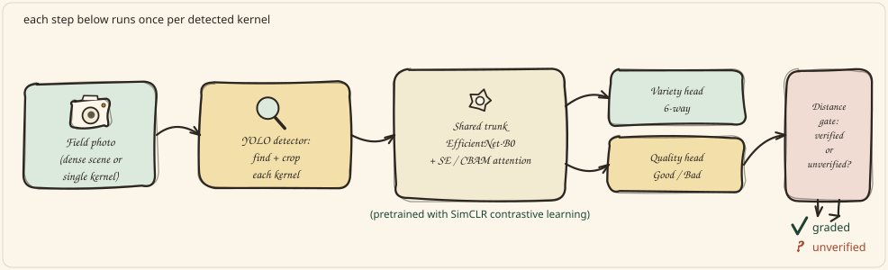
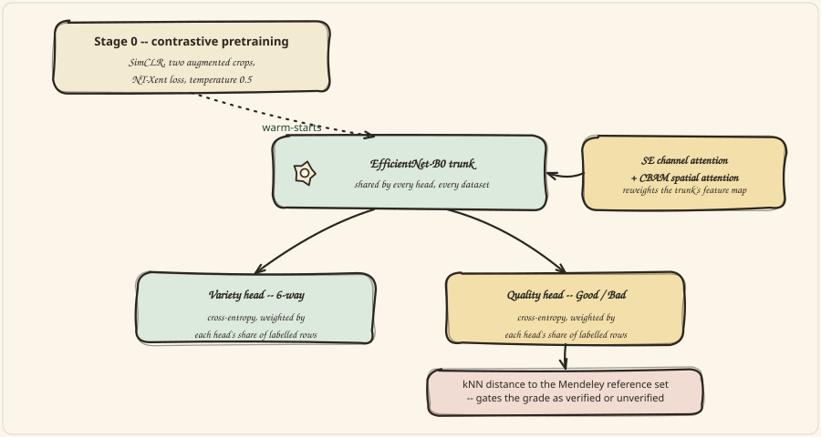

<div align="center">


# AI-Powered Maize Seed Variety Recognition & Detection System

Final-year B.Tech project. Built incrementally, phase by phase, from verified data —
see [`docs/`](docs/) for the full audit trail before reading any code.


     

</div>

### Contents
- [How it works](#how-it-works)
- [Start here](#start-here)
- [Status](#status)
- [Headline result — read before citing any accuracy figure](#headline-result--read-before-citing-any-accuracy-figure)
- [Key ground rule](#key-ground-rule)

---

## How it works

A field photo goes in; a graded, identified kernel comes out — or a candid "I can't verify this one" instead of a confident guess.

<p align="center">
  
</p>

Every crop the detector produces goes through one shared model with two task heads, sitting on a trunk that was warmed up with self-supervised contrastive learning before it ever saw a label:

<p align="center">
  
</p>

The gate under the quality head is the part worth reading twice: softmax confidence turned out to be *higher* on images the head had never trained on than on real test data (see [Key ground rule](#key-ground-rule)), so the platform doesn't trust confidence to know what it doesn't know. It measures representation distance to real training data instead, and says so when a kernel falls outside the region it has evidence for. Full derivation, every constant, and the equations behind each box: [`docs/09_PROJECT_STATUS_REPORT.md`](docs/09_PROJECT_STATUS_REPORT.md) and [`docs/05_ARCHITECTURE.md`](docs/05_ARCHITECTURE.md).

## Start here
1. [`docs/01_RESOURCE_INVENTORY.md`](docs/01_RESOURCE_INVENTORY.md) — what was actually provided, vs. what the
   original master prompt assumed.
2. [`docs/02_LITERATURE_SURVEY_ANALYSIS.md`](docs/02_LITERATURE_SURVEY_ANALYSIS.md) — research foundation from the 48-paper
   survey (motivation, gaps, novelty).
3. [`docs/03_DATASET_AUDIT.md`](docs/03_DATASET_AUDIT.md) — full audit of all 4 real datasets, plus the split-integrity amendment.
4. [`docs/04_FUNCTIONALITY_COVERAGE_MATRIX.md`](docs/04_FUNCTIONALITY_COVERAGE_MATRIX.md) — what is/isn't genuinely supported.
5. [`docs/05_ARCHITECTURE.md`](docs/05_ARCHITECTURE.md) — the final system architecture built from that evidence.

## Status
**Complete.** All training has run on the local RTX 4060 — contrastive pretraining and the four-way ablation for both variety datasets, the group-aware Dataset B re-run, the unified two-head served model, YOLO seed detection, and both FAISS similarity indices. The full pipeline is verified end-to-end through the Python API, over HTTP, and through the live React frontend; `pytest tests/` reports **40 passed, 0 failed**.

- [`docs/09_PROJECT_STATUS_REPORT.md`](docs/09_PROJECT_STATUS_REPORT.md) — start here: results, caveats, and what they mean.
- [`docs/11_LOCAL_TRAINING_RUN_LOG.md`](docs/11_LOCAL_TRAINING_RUN_LOG.md) — both training runs, every result, and the bugs they exposed.
- [`docs/10_RESULTS_COMPARISON.md`](docs/10_RESULTS_COMPARISON.md) — the four-way ablation, leaked and corrected.
- [`docs/07_RUNBOOK.md`](docs/07_RUNBOOK.md) — how to reproduce all of it from a clean clone.

## Headline result — read before citing any accuracy figure

**An earlier version of this README reported that the central hypothesis was not supported. That conclusion has been withdrawn.**

It rested on a split that made the task memorisable. Dataset B's 17,713 image files are augmented copies of just **127 physical seeds**, and the original split placed copies of all 127 into all three splits — so every one of the 2,655 test images had a same-seed sibling in training. A model that has already seen all 127 seeds scores ~99.9% whether or not it has attention. The ablation had no room in which a difference could appear.

On a corrected, group-aware split (89 / 19 / 19 source seeds), with the contrastive encoder pretrained on the training split alone:

```
experiment          ORIGINAL (leaked)  GROUPED (honest)
baseline                       99.89%            85.35%
attention_only                 99.89%            85.31%
contrastive_only               99.96%            89.06%
full                           99.92%            87.97%

spread across variants:      0.0753 pp  ->  3.7467 pp
```

Because 2,669 test images represent only 19 seeds, significance is assessed per seed via paired Wilcoxon with Holm correction. **The proposed full model significantly outperforms its attention-only ablation** (+2.63pp, winning on 12 of 19 seeds, p = 0.0052). **Cognitive attention alone still contributes nothing** (p = 0.68) — that part of the original finding survives. Contrastive pretraining is the component carrying the effect.

State the limitation alongside the result: n = 19 seeds, one run per variant. `contrastive_only` posts the highest mean while failing its own significance test, which is what an underpowered comparison looks like. See [`docs/09_PROJECT_STATUS_REPORT.md`](docs/09_PROJECT_STATUS_REPORT.md) §6.9.

Dataset A was checked for the same defect and is clean — zero test images have a ≥0.99-correlation twin in training. Its results stand.

## Key ground rule
**Quality assessment is now real, and bounded.** The Mendeley *EfficientMaize* dataset supplies genuine expert-assigned Good/Bad kernel labels (4,846 images, zero byte-overlap with the original three datasets), and the quality head trained on it scores **97.25%** test accuracy with 99.1% precision on the defective class. This supersedes the synthetic defect classifier, which is off by default.

The bound matters as much as the number. Applied to Dataset A — imagery it was never trained on — the head calls **71% of a clean variety dataset defective at 89% mean confidence**. Softmax confidence does not detect this; it is *higher* on some out-of-distribution data than on real test data. The platform therefore gates quality on representation distance, catching 100% of Dataset A and 88% of dense-scene serve-time crops, and renders such grades as **unverified extrapolations** in visually distinct styling rather than as defects. The threshold is deliberately conservative — it withholds ~32% of in-distribution grades as unverified — because asserting a defect wrongly is worse than declining to grade.

Still not supported, and listed as such in the UI: defect *type* classification, severity scoring (a confidence is not a severity), pixel-level segmentation, foreign-object identification, and fungal/insect/disease diagnosis — the last because published kernel-level fungal detection relies on NIR and hyperspectral bands an RGB camera cannot observe. See [`docs/04_FUNCTIONALITY_COVERAGE_MATRIX.md`](docs/04_FUNCTIONALITY_COVERAGE_MATRIX.md).

<div align="center">


Final-year B.Tech project · every figure above is cited to a file and a line

</div>
